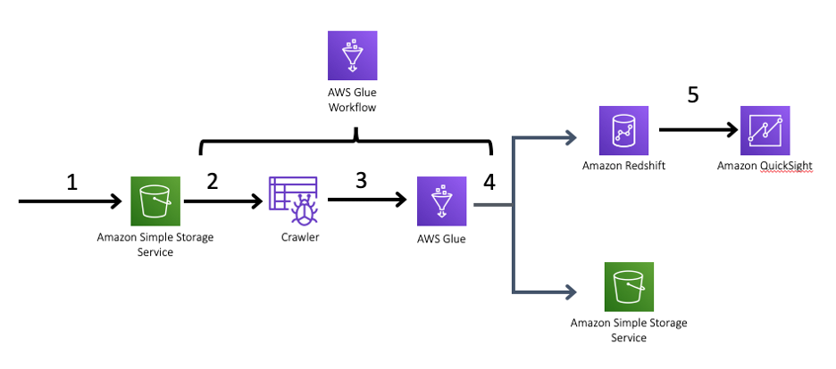
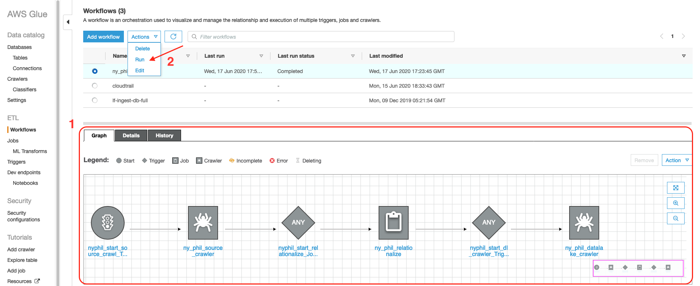
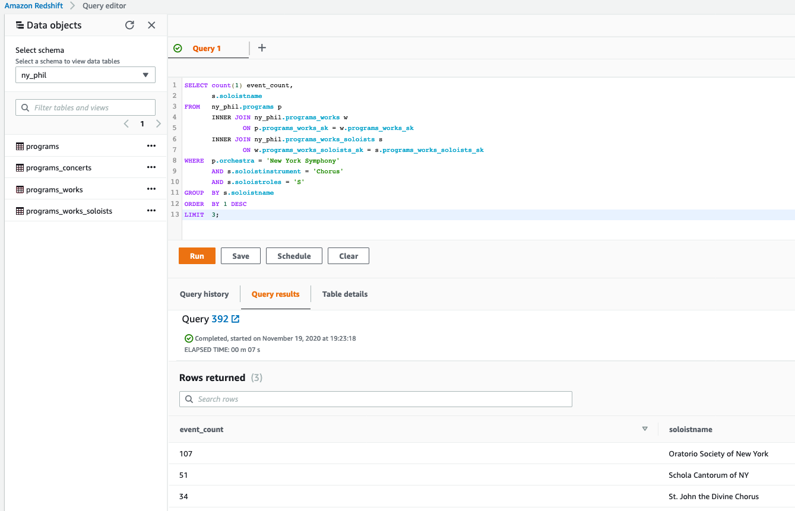

## Optimize nested data query performance on Amazon S3 data lake or Amazon Redshift data warehouse using AWS Glue
The bulk of the of the data generated today is unstructured and, in many cases, composed of highly complex, semi-structured and nested data. Decision makers in every organization need fast and seamless access to analyze these data sets to gain business insights and to create reporting. [Amazon Redshift](https://aws.amazon.com/redshift/), a fast, fully managed cloud data warehouse that makes it simple and cost-effective to analyze all your data using standard SQL and your existing Business Intelligence (BI) tools, allows you to query petabytes of structured and semi-structured data across your data warehouse and your data lake.  


As an example of a highly nested json file that uses multiple constructs such as arrays and structs, we are using an open data set from the [New York Philharmonic performance history repository](https://github.com/nyphilarchive/PerformanceHistory). A sample json snippet from this data set illustrates below an array of structs, with multiple nesting levels:

```json

{
	"programs": [{
		"id": "46ba9c05-6400-4337-96a1-95a91ae0f330-0.1",
		"programID": "10254",
		"orchestra": "New York Symphony",
		"season": "1926-27",
		"concerts": [{
			"eventType": "Subscription Season",
			"Location": "Manhattan, NY",
			"Venue": "Carnegie Hall",
			"Date": "1926-10-02T05:00:00Z",
			"Time": "8:30PM"
		}],
		"works": [{
				"ID": "10208*",
				"composerName": "Low,",
				"workTitle": "INTERNATIONAL",
				"conductorName": "Shaeffer, Joseph",
				"soloists": [{
					"soloistName": "Freiheit Gesangs Farein of New York",
					"soloistInstrument": "Chorus",
					"soloistRoles": "S"
				}]
			},
			{
				"ID": "10209*",
				"composerName": "Edelshtadt,",
				"workTitle": "VACHT UF",
				"conductorName": "Shaeffer, Joseph",
				"soloists": [{
					"soloistName": "Freiheit Gesangs Farein of New York",
					"soloistInstrument": "Chorus",
					"soloistRoles": "S"
				}]
			}
		]
	}]
}

```


AWS blog posts on nested JSON with [Amazon Athena](https://aws.amazon.com/blogs/big-data/analyze-and-visualize-nested-json-data-with-amazon-athena-and-amazon-quicksight/) and [Amazon Redshift Spectrum](https://aws.amazon.com/blogs/big-data/working-with-nested-data-types-using-amazon-redshift-spectrum/) cover in great detail on how to efficiently query such nested dataset . Here, we’ll describe an alternate way of optimizing query performance for nested data ensuring simplicity, ease of use, and fast access for end-users, who need to query their data in a relational model without having to worry about the underlying complexities of different levels of nested unstructured data.  


We use [AWS Glue](https://aws.amazon.com/glue/), a fully managed serverless extract, transform, and load (ETL) service, which helps to flatten such complex data structures into a relational model using its relationalize functionality, as explained in this [AWS Blog](https://aws.amazon.com/blogs/big-data/simplify-querying-nested-json-with-the-aws-glue-relationalize-transform/). Here, we will expand on that and create a simple automated pipeline to transform and simplify such a nested data set.

## Solution architecture and Deployment
Let us now describe how we process the data. The following architecture diagram highlights the end-to-end solution. We build an AWS Glue Workflow to orchestrate the ETL pipeline and load data into Amazon Redshift in an optimized relational format that can be used to simplify the design of your dashboards using BI tools like Amazon QuickSight:


Below is the simple execution flow for this solution, which you may deploy with [CloudFormation template](flatten_json_cf_template.yml):  

1.	The source data is ingested into Amazon S3.  
2.	At a scheduled interval, an AWS Glue Workflow will execute, and perform the below activities:  
a) Trigger an AWS Glue Crawler to automatically discover and update the schema of the source data.  
b) Upon a successful completion of the Crawler, run an [ETL job](flatten_join_nested_file.py), which will use the AWS Glue `Relationalize` transform to optimize the data format. When a data structure includes arrays, the relationalize transform extract these as separate tables and adds all the necessary keys to join back to the parent table. This job also loops through the tables and standardizes the table and column names. Optionally, it also joins the columns together in a wide, fully denormalized table.  
c) As a final step, it loads the data into an Amazon Redshift Cluster, and also into an Amazon S3 data lake in columnar file format, Apache Parquet.  
3.	Now, we can visualize the data in Redshift or Athena with simple SQL queries.  


## Testing the workflow

Once the stack is successfully deployed, you can review and then launch your ETL pipeline

1. Log in to the AWS Glue console.  
2. Choose Workflows , select the workflow created by the AWS [Cloudformation stack](flatten_json_cf_template.yml) (ny_phil_wf), and then review the Graph and the various steps involved.  
3. Run the workflow.  
     
4. Visualize data with simple SQL queries to analyze answer to questions like “Who were the top three Chorus soloists at New York Symphony?”

```sql

		SELECT count(1) event_count,
		       s.soloistname
		FROM   ny_phil.programs p
		       INNER JOIN ny_phil.programs_works w
		               ON p.programs_works_sk = w.programs_works_sk
		       INNER JOIN ny_phil.programs_works_soloists s
		               ON w.programs_works_soloists_sk = s.programs_works_soloists_sk
		WHERE  p.orchestra = 'New York Symphony'
		       AND s.soloistinstrument = 'Chorus'
		       AND s.soloistroles = 'S'
		GROUP  BY s.soloistname
		ORDER  BY 1 DESC
		LIMIT  3;		

```

   


## Security

See [CONTRIBUTING](CONTRIBUTING.md#security-issue-notifications) for more information.

## License

This library is licensed under the MIT-0 License. See the LICENSE file.

